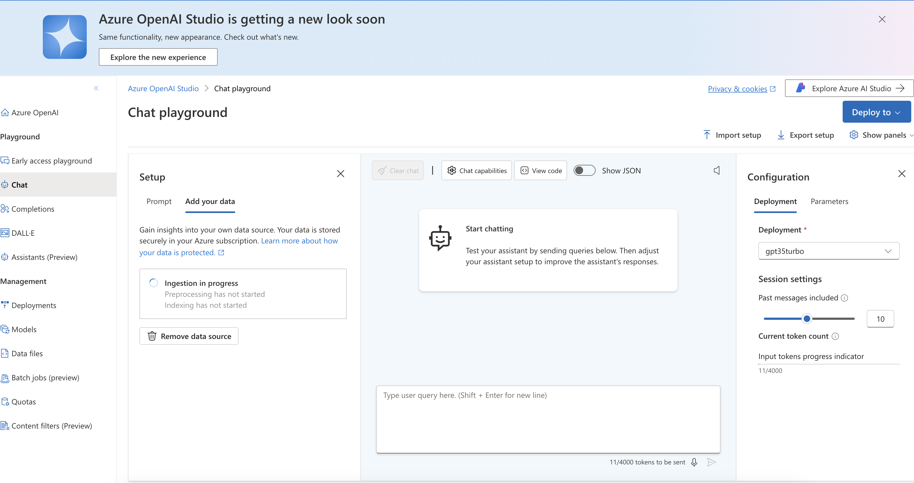

# RAG Azure example

This readme explains how to use Azure AI Search to perform RAG (Retrievel Augmentation) with Azure Open AI Service.

## Pre-requesites

To compelete this example the following is required:

* Azure subscription with Azure Open AI Service
* Azure AI Search
* Blob storage

## Create storage account

Create an Azure storage account in the same resource group where your Azure Open AI service is.

Create a container called brochure.

## Deploy a GPT 35 turbo model

For this exercise in your Azure Open AI service deploy a gpt-35-turbo 16k model.

Open Azure Open AI Studio and enter some prompts in the chat playground area.

## Connect your data to chat playground

In Azure Open AI Studio you can use your own data to supplement the prompts you are generating.

In Chat playground select the tab "Add your data".

To complete this step you will need to select the previously created Storage account to host your files
and you will need to select the option to create an Azure search index.

The following screenshots show each step:

 - Specify Azure search resource to create
 - Specify an Azure index to creete
 - Specify the previously created blob storag with container to upload files

- Upload the source files that will be used

- Select keyword from the dropdown

- Select API key

